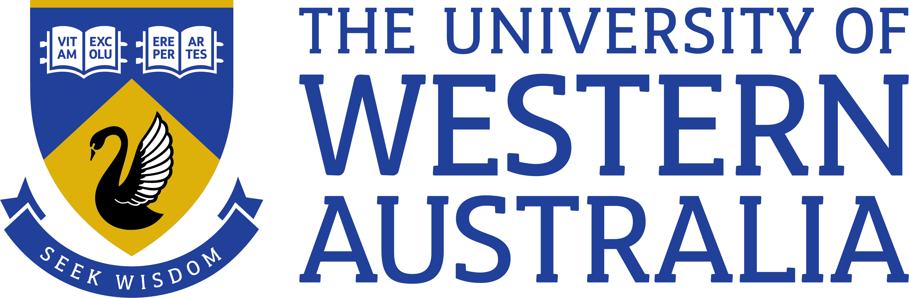
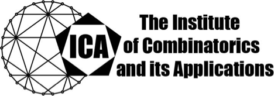

### About

ACC is the annual conference of the Combinatorial Mathematics Society of Australasia (CMSA). It covers all areas of combinatorics in mathematics and computer science. This conference was previously known as ACCMCC (Australasian Conference on Combinatorial Mathematics and Combinatorial Computing), and the name was changed to ACC from 2020 onwards following a recommendation of the CMSA. Past and future editions of ACCMCC/ACC can be found [here](http://combinatorics-australasia.org/conferences.html).
The 45th ACC will be hosted by [The University of Western Australia](https://www.uwa.edu.au), Perth, Australia, 11-15 December 2023. It will be an in-person, face-to-face, conference.

### Invited speakers

- [Sara Davies](https://smp.uq.edu.au/profile/270/sara-davies) (The University of Queensland)
  > The Hamilton decomposition problem
- [Gary Greaves](https://personal.ntu.edu.sg/gary/) (Nanyang Technical University)
  > How to design a graph with three eigenvalues
- [Krystal Guo](https://krystalguo.com/) (University of Amsterdam)
  > Algebraic graph theory and quantum walks
- [André Kündgen](https://public.csusm.edu/akundgen/) (California State University San Marcos)
  > The Saturation Spectrum of odd cycles
- [Padraig Ó Catháin](https://sites.google.com/site/pocathain/) (Dublin City University)
  > Quadratic forms in design theory
- [Tibor Szabó](https://page.mi.fu-berlin.de/szabo/) (Freie Universität Berlin)
- [Geertrui Van de Voorde](https://www.math.canterbury.ac.nz/~g.voorde/) (University of Canterbury)
  > 'Segre-type' theorems: combinatorial characterisations for algebraic objects
- [Gabriel Verret](https://profiles.auckland.ac.nz/g-verret) (University of Auckland)

### Key dates

- Early bird registration deadline: 6 November 2023
- Deadline for submission of abstracts: 27 November 2023 

### Organising committee

A/Prof. John Bamberg, Prof. Michael Giudici, Prof. Gordon Royle, Prof. Cheryl Praeger, A/Prof. Alice Devillers, Dr Luke Morgan.

### Contact

[45ACCuwa@gmail.com](mailto:45ACCuwa@gmail.com)

### Sponsors and support

We are very grateful for the support from the following institutions and organisations:
- [The School of Physics, Mathematics, and Computing](https://www.uwa.edu.au/schools/Physics-Mathematics-Computing) 
- [Optiver](https://optiver.com/) 
- [The Institute of Combinatorics and its Applications](http://the-ica.org/) 

